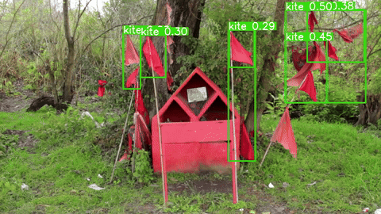

![[online-marketplace-ideas.jpg]]

<small>Joshua Citarella and Caroline Busta, [*The Online Marketplace of Ideas*](https://joshuacitarella.substack.com/p/the-online-marketplace-of-ideas?__readwiseLocation=) (2026)</small>

> [!custom]+ VM303-01  
> [School of Film, Television, & Media Arts](https://emerson.edu/schools/school-of-film-television-and-media-arts/)  
> [Emerson College](https://emerson.edu/)  
> Fall Semester 2026  
> Tues/Thur 3 Sept-17 Dec 2026  
> 18:00-19:45  
> Ansin Building 605  
> [Dr. Martin Roberts](http://mroberts1.github.io/)  
> Office: 916D  
> Hours: Tues 16:00-17:00  
> [YouTube playlist](https://www.youtube.com/playlist?list=PLVFq_7OQlr58)   
> [<svg role="img" aria-label="Email" viewBox="0 0 512 512" height="1em" fill="currentColor" style="vertical-align:-0.125em"><title>Email</title><path d="M0 128Q1 101 19 83Q37 65 64 64H448Q475 65 493 83Q511 101 512 128V384Q511 411 493 429Q475 447 448 448H64Q37 447 19 429Q1 411 0 384V128ZM48 128V150L221 292Q237 304 256 304Q275 304 292 292L464 150V127Q463 113 448 111H64Q49 113 48 127V128ZM48 212V384Q49 399 64 400H448Q463 399 464 384V212L322 329Q292 352 256 352Q220 352 189 329L48 212Z"/></svg>](mailto:martin_roberts@emerson.edu) \| [<svg role="img" aria-label="Mastodon" viewBox="0 0 448 512" height="1em" fill="currentColor" style="vertical-align:-0.125em"><title>Mastodon</title><path d="M433 179Q432 131 416 103Q401 76 386 64Q370 53 369 53Q369 53 369 53Q336 39 280 34Q224 30 168 34Q112 39 79 53Q78 53 62 64Q47 76 32 103Q16 131 15 179Q15 188 15 197Q14 255 19 311Q23 368 46 410Q69 453 121 468Q182 483 224 480Q262 477 283 470Q303 462 303 462Q303 462 303 462L302 425Q301 425 278 430Q256 435 225 435Q193 435 167 426Q141 417 135 381Q134 374 134 367Q195 380 241 379Q288 378 308 374Q311 374 313 374Q356 368 387 346Q418 325 424 301Q431 260 432 221Q433 182 433 179ZM358 304H311V190Q310 165 295 157Q279 148 264 158Q248 168 247 197V260H201V197Q200 168 184 158Q169 148 154 157Q138 165 137 190V304H90Q90 273 90 249Q89 194 92 169Q95 144 109 129Q130 107 161 108Q193 108 212 135L224 155L236 135Q256 108 287 108Q318 107 339 129Q354 144 356 169Q359 194 358 249Q358 272 358 304Z"/></svg>](https://merveilles.town/@dokoissho) \| [<svg role="img" aria-label="GitHub" viewBox="0 0 496 512" height="1em" fill="currentColor" style="vertical-align:-0.125em"><title>GitHub</title><path d="M166 397Q165 401 161 401Q155 401 155 397Q156 394 160 394Q165 394 166 397ZM135 393Q134 396 139 398Q144 399 145 396Q146 392 141 391Q136 390 135 393ZM179 391Q174 392 174 396Q175 399 180 399Q185 397 185 394Q184 391 179 391ZM245 8Q138 10 70 78Q2 146 0 252Q1 337 47 401Q93 465 170 491Q188 492 187 479Q187 475 187 464Q187 441 187 418Q185 418 168 420Q150 421 130 416Q110 410 102 388Q102 386 94 372Q86 359 74 351Q72 350 66 343Q59 337 76 336Q77 335 90 340Q103 344 114 362Q132 389 153 389Q175 389 187 383Q191 359 203 349Q159 347 126 327Q93 308 91 238Q91 218 97 205Q102 192 114 180Q112 174 110 156Q108 138 117 112Q135 109 159 123Q184 136 186 139Q186 139 186 139Q216 130 249 130Q281 130 312 139Q312 138 325 130Q337 122 353 116Q369 109 381 112Q390 138 388 156Q386 174 383 180Q395 192 402 205Q409 218 409 238Q408 286 392 309Q375 331 349 339Q323 347 294 349Q310 360 311 395Q311 432 311 461Q311 474 311 479Q310 492 328 491Q404 465 450 401Q495 337 496 252Q495 182 462 127Q428 72 372 40Q315 9 245 8ZM97 353Q95 355 98 358Q101 361 103 359Q105 357 102 354Q100 351 97 353ZM86 345Q86 347 89 349Q92 350 93 348Q94 346 91 344Q88 343 86 345ZM119 380Q117 383 120 387Q124 390 127 388Q128 385 125 381Q121 378 119 380ZM107 366Q105 368 107 372Q110 375 113 374Q115 372 113 368Q110 364 107 366Z"/></svg>](https://github.com/mroberts1/) \| [<svg role="img" aria-label="Twitter" viewBox="0 0 512 512" height="1em" fill="currentColor" style="vertical-align:-0.125em"><title>Twitter</title><path d="M459 152Q460 159 460 165Q460 165 460 165Q460 236 425 304Q391 372 324 417Q258 462 161 464Q71 463 0 417Q12 418 25 418Q100 417 156 373Q120 372 94 352Q68 332 58 301Q67 302 77 302Q92 302 105 299Q68 291 45 263Q22 235 21 196V194Q42 206 68 208Q24 177 21 120Q22 91 36 67Q75 115 131 144Q186 173 252 177Q250 165 250 153Q251 109 280 79Q310 49 354 48Q401 49 431 81Q467 74 498 56Q485 93 452 114Q483 110 512 97Q490 129 459 152Z"/></svg>](https://twitter.com/mroberts_vma)\

## Overview

The theme of this semester is **Lost Futures**. Rather than speculating *about* the future of digital media culture in the usual futurist fashion, we will look instead at contemporary writings *from* the future of digital media about its history over the past thirty years, the unexpected and even unlikely directions that it has taken, the failure of its expected futures to arrive, and the reasons for this. This historical perspective should serve as a corrective to both the utopian and dystopian futures predicted in our present, and the limited horizons of speculative futurism itself. The course is thus intended as a kind of letter to the future, a digital time capsule: it's designed so that five, ten, or fifteen years from now, we can look at the syllabus and ask ourselves: what did the future mean to us, back then? Not the future that we **could have had**, but the future that we **will have had**.

A key component of the course this semester is the Open Source software movement and Open Education Resources (OER). These are online academic and other resources that are not behind paywalls, have Creative Commons licenses, and/or are free to use. We will examine what these licenses are and how to use them in your own workflows for publishing your work online. We will also consider how the open-source model works (if at all) for the current generation of commercial AI agents such as Claude Code, Hermes, etc., and explore open-source, local (i.e. running on a local server on your own machine, not cloud-based) alternatives to them. A series of workshops will show you how to set up such a system on your own computer using [OpenCode](https://opencode.ai/) that uses either a local or cloud-based model. 

## Format

This is primarily a critical-thinking course, although it includes a practical and production component. This means that it encourages you to think reflexively and analytically about the digitally-mediated cultural practices that the course considers, as well as to participate in them; for example, you will be invited to experiment with image-synthesis and text-generating software and analyze the results using key concepts and theoretical frameworks.

## Outcomes

By the end of the course, students will:

- have acquired a deeper understanding of the social, cultural, and political dimensions of digital technologies and networked communication;
- be able to apply critical thinking to contemporary developments in digital culture using relevant analytical concepts and both qualitative and quantitative methodologies such as cultural analytics;
- understand basic principles of algorithmic image synthesis on a variety of platforms;
- have reflected upon and discussed the larger significance of machine learning systems within global networked societies.
- have acquired an understanding of the history of the Open Source software movement, peer-to-peer networking alternatives to commercial providers and platforms, the use of Creative Commons licenses and Open Education Resources (OER).

## Course Texts

Selected chapters from the texts below will be made available as PDFs; you are nevertheless encouraged to purchase at least several of texts that are of interest and read more of them.

Note on formats: A number of texts listed in the [Bibliography](bibliography) are available as e-books and/or audiobooks. You are encouraged to make use not only of print media but also of these screen-based and audio formats.

A: Audiobook  
E: Ebook

- Benedikt Gross, Hartmut Bohnacker, Julia Laub, and Claudius Lazzeroni, [*Generative Design*](http://www.generative-gestaltung.de/2/). New York: PA Press, 2018.

- A/E:[Freya India](jhttps://www.freyaindia.co.uk/), [*GIRLS®: Generation Z and the Commodification of Everything*](https://us.macmillan.com/books/9781250442222/girls/). New York: MacMillan Books, 2026.

- A/E: Kazuo Ishiguro, [*Klara and the Sun*](https://www.penguinrandomhouse.com/books/653825/klara-and-the-sun-a-gma-book-club-pick-by-kazuo-ishiguro/). London: Penguin Random House, 2021.

- Christopher Kelty, [*The Internet We Could Have Had*](https://www.politybooks.com/bookdetail?book_slug=the-internet-we-could-have-had--9781509574506). Cambridge: Polity Press, 2026)

- E: Bogna Konior, [*The Dark Forest Theory of the Internet*](https://www.politybooks.com/bookdetail?book_slug=the-dark-forest-theory-of-the-internet--9781509569250). Cambridge: Polity Press, 2026.

- E: Trevor Paglen, [*How To See Like A Machine*](https://www.versobooks.com/products/3477-how-to-see-like-a-machine?_pos=1&_psq=paglen&_psid=1b17437f0&_ss=e). New York: Verso, 2026.

- E: Hito Steyerl, [*Medium Hot: Images in the Age of Heat*](https://www.versobooks.com/products/3329-medium-hot). London: Verso, 2026.

## Assignments & Evaluation

**Commentary** (weekly discussion posts) (20%)

One or more discussion posts per week on reading assignments, submitted anytime during the week of the assignments in question. A minimum of ten weekly posts is required.

**Keywords** (20%) 

250-500-word contribution to Glossary of Key Terms in contemporary digital media culture. Due mid-semester.

**Generative Art** (20%)   

Using one of the generative art platforms focused on in the course, submit one work that was generated using one of these systems. Images may be still or moving (e.g. animations, GIF loops, etc.). Due week after Thanksgiving

**Open Education Resources (OER)/OpenCode Research Assignment** (25%)  

Further details will be provided. 1,250-1,500 words. Due last week of classes.

**Engagement** (15%)

Includes attendance, punctuality

## Schedule of Classes

*Week 1*

09-02_Thur

Introduction: Remembering The Future

***

*Week 2*

**Remembering the Internet**

09-08_Tues

Chris Kelty, *The Internet We Could Have Had* (chs. TBA)

09-10_Thur

***

*Week 3*

**Hiding from Predators**

09-15_Tues

Bogna Konior, *The Dark Forest Theory of the Internet* (chs. TBA)

09-17_Thur

***

*Week 4*

**Retouch, Refine, Remodel: Social Media**

09-22_Tues

Freya India, "Filtered" (in *GIRLS®*)

09-24_Thur

***

*Week 5*

**BRAT**

09-29_Tues

Screening: Charli XCX, *Brat*

10-01_Thur

***

*Week 6*

**Internet Cinema**

10-06_Tues

- [redactedcut](https://www.instagram.com/p/C5VmEzIp1Ge/) WARNING: Strobing imagery
- *PalCoreCore* (Dana Dawud, 2024)

10-08_Thur

***

*Week 7*

**Synthetic Data: Model Collapse**

10-13_Tues

- Ted Chiang, "[ChatGPT Is A Blurry JPEG of the Web](https://www.newyorker.com/tech/annals-of-technology/chatgpt-is-a-blurry-jpeg-of-the-web?__readwiseLocation=)" (*The New Yorker*, 9 February 2023)
- Richard Baraniuk, "[The Birth of the Open-Source Learning Revolution](https://www.ted.com/talks/richard_baraniuk_the_birth_of_the_open_source_learning_revolution?__readwiseLocation=)" (TED talk)

10-15_Thur

***

*Week 8*

**Artificial Companions**

10-20_Tues

- Kazuo Ishiguro, *Klara and the Sun* (read at least the first section)

10-22_Thur

- Screening: *After Yang* (kogonada, 2021)

***

*Week 9*

**Generative Art: Creative Coding**

10-27_Tues
 
- Benedikt Gross, Hartmut Bohnacker, Julia Laub, and Claudius Lazzeroni, [*Generative Design*](http://www.generative-gestaltung.de/2/)

10-29_Thur

**Datamoshing & Diffusion**

***

*Week 10*

11-03_Tues

**Operational Images: Sensing and Object Detection**

- Jussi Parikka, *Operational Images*
- Trevor Paglen, "Invisible Images" (*How To See Like A Machine*, ch. 1)

11-05_Thur

**The Online Marketplace of Art: Cryptoart**

<video autoplay loop muted playsinline controls="false" width="100%">

<source src="video/artifact.mp4" type="video/mp4">

</video>

<!--  -->

<small>NFT art: Humdrum, "[praying in the wrong language](https://objkt.com/collections/KT1E7znsyTBbvpzTv3AbyWZ2K9XNwzt3zViJ)" (22 July 2025)  
Current price: $62.18 (100.00 ꜩ) </small>

***

*Week 11*

**Poor Images: Post-Internet Aesthetics**

11-10_Tues

- Hito Steyerl, "In Defense of Poor Images"
- Hito Steyerl, *Medium Hot* (chs. TBA)

11-12_Thur

- Hadi Afif, "[Cross-Sectioning the slop: Notes on Internet cinema](https://www.dazed.me/film-tv/cross-sectioning-the-slop-notes-on-internet-cinema)" (DAZED Middle East, 20 April 2026)
- Anika Meier, "[The AI Slop of Pierre Huyghe](https://anikameierstatusupdate.substack.com/p/the-ai-slop-of-pierre-huyghe?__readwiseLocation=)" (Substack, 23 January 2026)
- "[Will AI Slop and Deep Fakes Kill Culture?](https://youtu.be/3mAW5swMOME") (panel discussion with Caroline Busta)

***

*Week 12*

**Playable Worlds: Spatial Intelligence**

11-17_Tues

- Fei Fei Li, "[From Words to Worlds: Spatial Intelligence is AI’s Next Frontier](https://drfeifei.substack.com/p/from-words-to-worlds-spatial-intelligence)" (World Labs, 10 November 2025)
- "[Atlas: A World Model for Spatial Intelligence](https://www.worldlabs.ai/blog/atlas)" (World Labs, 1 September 2026)
- "[Marble: A Multimodal World Model](https://www.worldlabs.ai/blog/marble-world-model)" (World Labs, 12 November 2025)

11-19_Thur

- "[3D As Code](https://www.worldlabs.ai/blog/3d-as-code)" (World Labs, 3 March 2026)
- "[A Functional Taxonomy of World Models](https://www.worldlabs.ai/blog/taxonomy-of-world-models)" (World Labs, 3 June 2026)

***

*Week 13*

11-24_Tues

Marble/Atlas workshop

11-26_Thur: NO CLASS (Thanksgiving)

***

*Week 14*

12-01_Tues

Presentations: OER Resarch Projects

12-03_Thur

Presentations: OER Resarch Projects

***

*Week 15*

12-08_Tues

Presentations: Creative Projects

12-10_Thur

Presentations: Creative Projects

***

*Week 16*

12-15_Tues 

Conclusion

12-17_Thur

**Last day of classes**

***

## Policies

**Academic Honesty**

It is the responsibility of all Emerson students to know and adhere to the College's policy on plagiarism, which can be found at [emerson.edu/policies/plagiarism](https://emerson.edu/policies/plagiarism "Plagiarism"). If you have any question concerning the Emerson plagiarism policy or about documentation of sources in work you produce in this course, speak to your instructor.

**Diversity**

Every student in this class will be honored and respected as an individual with distinct experiences, talents, and backgrounds. Issues of diversity may be a part of class discussion, assigned material, and projects. The instructor will make every effort to ensure that an inclusive environment exists for all students. If you have any concerns or suggestions for improving the classroom climate, please do not hesitate to speak with the course instructor or to contact the Social Justice Center at 617-824-8528 or by email at [sjc\@emerson.edu](mailto:sjc@emerson.edu).

**Discrimination, Harassment, or Sexual Violence**

If you have been impacted by discrimination, harassment, or sexual violence, I am available to support you, and help direct you to available resources on and off campus. Additionally, the Office of Equal Opportunity ([oeo\@emerson.edu](mailto:oeo@emerson.edu "Email the Office of Equal Opportunity"); 617-824-8999) is available to meet with you and discuss options to address concerns and to provide you with support resources. Please note that I because I am an Emerson employee, any information shared with me related to discrimination, harassment, or sexual violence will also be shared with the Office of Equal Opportunity.  If you would like to speak with someone confidentially, please contact the Healing & Advocacy Collective, the Emerson Wellness Center, or the Center for Spiritual Life.

**Accessibility**

Emerson is committed to providing equal access and support to all students who qualify through the provision of reasonable accommodations, so that each student may fully participate in the Emerson experience. If you have a disability that may require accommodations, please contact Student Accessibility Services (SAS) at [SAS\@emerson.edu](mailto:SAS@emerson.edu) or 617-824-8592 to make an appointment with an SAS staff member.

Students are encouraged to contact SAS early in the semester. Please be aware that accommodations are not applied retroactively.

**Writing & Academic Resource Center**

Students are encouraged to visit and utilize the staff and resources of Emerson's Writing Center, particularly if they are struggling with written assignments. The Writing Center is located at 216 Tremont Street on the 5th floor (tel. 617-824-7874).

**In-Class Recording**

Regardless of modality or whether this course is being recorded by the College with the permission of the students for classroom purposes, this class is considered a private environment and it is a setting in which copyrighted materials, creative works and educational records may be displayed. Audio or video recording, filming, photographing, viewing, transmitting, producing or publishing the image or voice of another person or that person's materials, creative works or educational records without the person's knowledge and expressed consent is strictly prohibited. 

***
