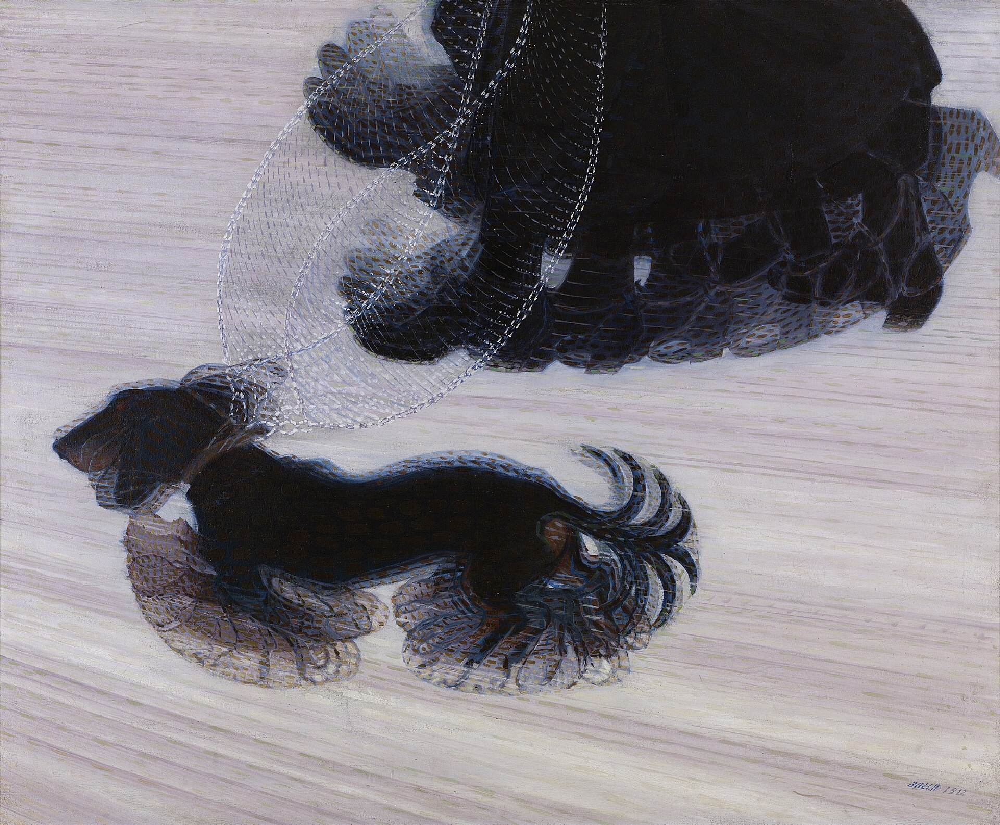

## Tuesday 6 October

_Giacomo Balla, "[Dinamismo di un cane al guinzaglio](https://en.wikipedia.org/wiki/Dynamism_of_a_Dog_on_a_Leash)" \[Dynamism of a Dog on a Leash\] (1912)_

- F.T. Marinetti, [Futurist Manifesto](https://www.italianfuturism.org/manifestos/foundingmanifesto/)
- Valentine de Saint Point, [Manifesto of the Futurist Woman](https://www.italianfuturism.org/manifestos/the-manifesto-of-futurist-woman/)
- Simon Denny, “[Epic Fury: The Dark Art of Defence Tech](https://www.artforum.com/features/simon-denny-art-defense-tech-1234747490/)” (_Artforum_, 20 April 2026)
## Thursday 8 October

- Mark Andressen, "[The Techno-Optimist Manifesto](https://a16z.com/the-techno-optimist-manifesto/)" (2023)
***

